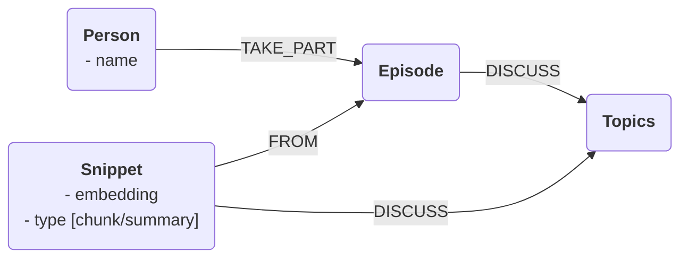

create an efficient RAG engine to answer not only concrete questions about podcasts, but also asbtract / general / summarization questions

## Ideas

## Graph Model



### Vector Index on Embeddings:

```
CREATE VECTOR INDEX moviePlots IF NOT EXISTS
FOR (m:Movie)
ON m.embedding
OPTIONS { indexConfig: {
 `vector.dimensions`: 1536,
 `vector.similarity_function`: 'cosine'
}}
```

```
MATCH (m:Movie {title: 'Godfather, The'})
CALL db.index.vector.queryNodes('moviePlots', 5, m.embedding)
YIELD node AS movie, score
RETURN movie.title AS title, movie.plot AS plot, score
```